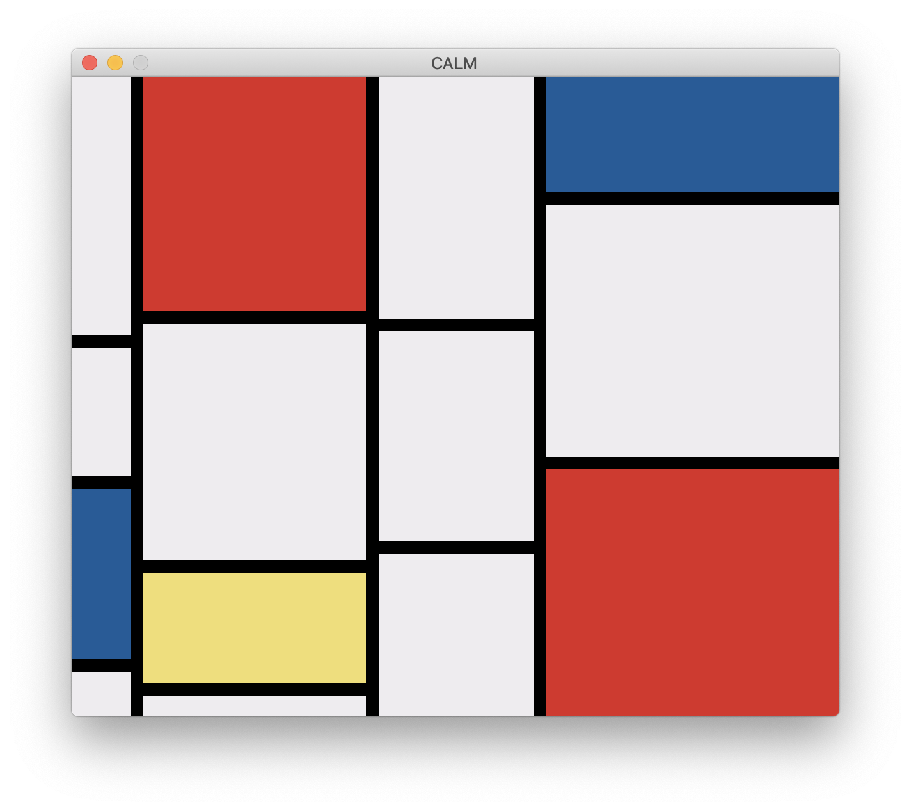

# CALM built-in gallery

This directory contains a few built-in examples for CALM.

You can read [this guide](https://calm2d.org/guide/) to know how to use them.

Here are some screenshots of those CALM apps:

### Mondrian

The random Piet Mondrian, in Lisp.

#### Fan

The blue circle, is the switch.

#### Meditator

The red circle, is clickable.

